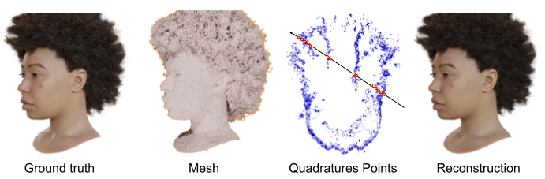

# Volumetric Rendering with Baked Quadrature Fields
Authors: Gopal Sharma, Daniel Rebain, Kwang Moo Yi and Andrea Tagliasacchi

This repository contains codebase for the Quadfield paper published at ECCV-2024.

[Paper](https://arxiv.org/pdf/2312.02202) | [Website](https://quadraturefields.github.io/)



## Installation
Experiments are done using `Python 3.10`, `cuda 11.3` and `torch 1.12.0`. Further see the requirements in requirements.txt.
Additional packages required for baking the texture maps: [xatlas](https://github.com/mworchel/xatlas-python) and [segmentor](https://github.com/ScanNet/ScanNet) for mesh segmentation.


## Dataset
Download [NeRF synthetic](https://www.matthewtancik.com/nerf) and [Shelly](https://research.nvidia.com/labs/toronto-ai/adaptive-shells/) datasets and put the scene directories in `dataset` directory.


    ├── dataset
    │   ├── chair
    │   └── kahdy
    │   └── lego


## Experiments
Experiments are done on Nvidia 3090 GPU.

### Training on NeRF synthetic
<details>
<summary>Train Nerf on a scene.</summary>
    
    bash scripts/run_nerfsynthetic.sh

</details>

<details>
<summary>Train quadrature field on a scene.</summary>
    
    bash scripts/run_nerfsynthetic_field.sh

</details>

<details>
<summary>Extract meshes.</summary>
    
    bash scripts/run_nerfsynthetic_mc.sh

</details>

<details>
<summary>Finetune field.</summary>
    
    bash scripts/run_nerfsynthetic_finetune.sh

</details>

The following steps are only needed for baking:

<details>
<summary>Fit spherical gaussians.</summary>
    
    bash scripts/run_nerfsynthetic_fit_sg.sh

</details>

<details>
<summary>Bake neural features and evaluate the model.</summary>
    
    bash scripts/run_nerfsynthetic_baking.sh

</details>


### Training on Shelly dataset
<details>
<summary>Train Nerf on a scene.</summary>
    
    bash scripts/run_shelly.sh

</details>

<details>
<summary>Train quadrature field on a scene.</summary>
    
    bash scripts/run_shelly_field.sh

</details>

<details>
<summary>Extract meshes.</summary>
    
    bash scripts/run_shelly_mc.sh

</details>

<details>
<summary>Finetune field.</summary>
    
    bash scripts/run_shelly_finetune.sh

</details>

The following steps are only needed for baking:

<details>
<summary>Fit spherical gaussians.</summary>
    
    bash scripts/run_shelly_fit_sg.sh

</details>

<details>
<summary>Bake neural features and evaluate the model.</summary>
    
    bash scripts/run_shelly_baking.sh

</details>


## Acknowledgements
We thank Ruilong Li for releasing [nerfacc](https://github.com/nerfstudio-project/nerfacc). Our codebase is heavily built on nerfacc and pycolmap.


## Bibliography
Please find below the BibTeX entry for this project:

```
@article{quadfields,
  title     = {Volumetric Rendering with Baked Quadrature Fields},
  author    = {Gopal Sharma, Daniel Rebain, Andrea Tagliasacchi, Kwang Moo Yi},
  journal   = {ECCV},
  year      = {2024},
}
```
